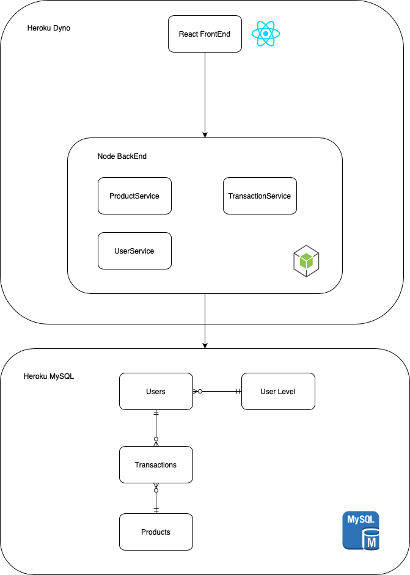

# Inventory Management

## High Level Design



## Development

#### Setup:

Add a `.env` file with the following keys:

```
DB_HOST=SAMPLE_DB_HOST
DB_USERNAME=SAMPLE_DB_USERNAME
DB_PASSWORD=SAMPLE_DB_PASSWORD
DB_DATABASE=SAMPLE_DB_DATABASE

REACT_APP_DB_OWNER_ID = 1
REACT_APP_DB_MANAGER_ID = 2
REACT_APP_DB_BUYER_ID = 3
REACT_APP_DB_CASHIER_ID = 4

JWT_SECRET=SAMPLE_JWT_SECRET
```

#### Front End:

`npm run dev-fe`

Develop in `./src`

#### Back End:

Make sure `mysql` is installed in your computer

`npm run dev-be`

Develop in `./routes`, `./models`, `./services`, etc.

## License

UNLICENSED
